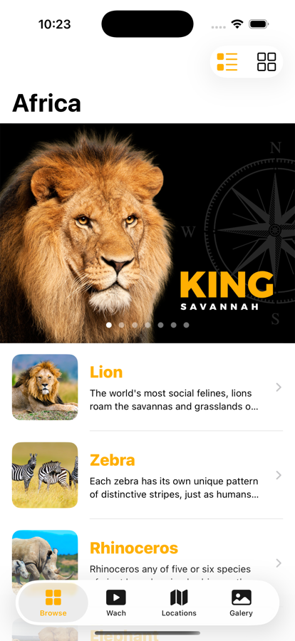
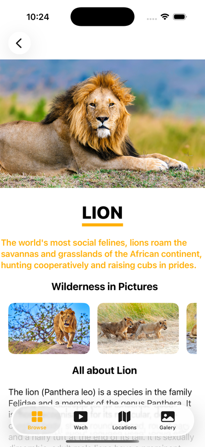
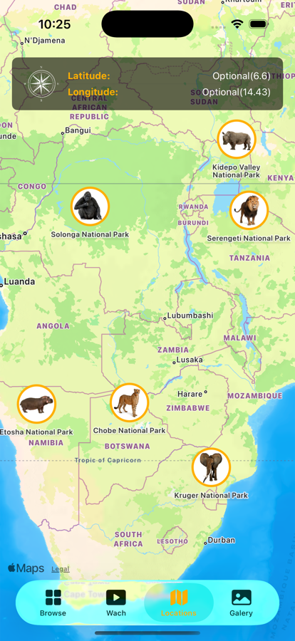
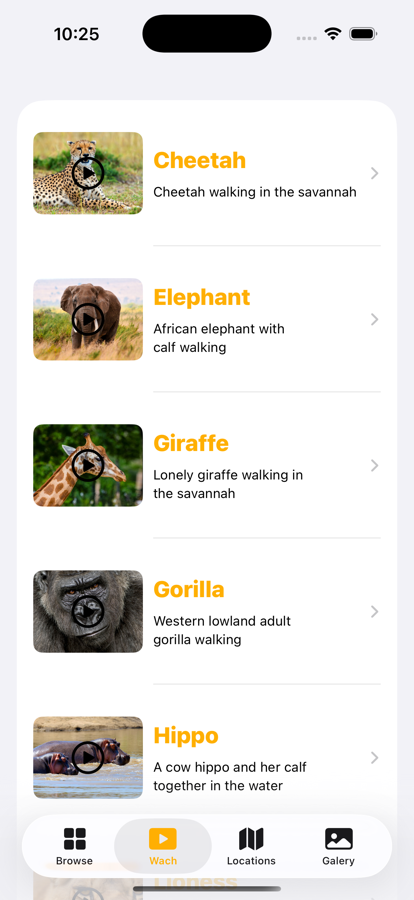
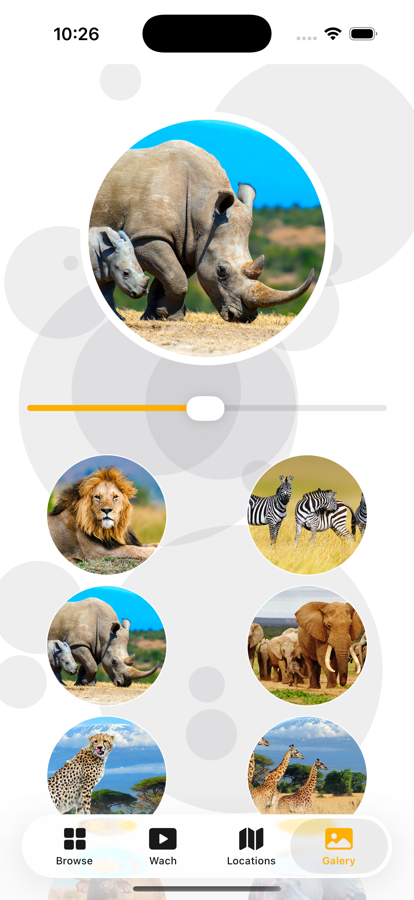

# Africa

A SwiftUI app that showcases African wildlife with a multi-tab experience (Browse, Watch, Locations, Gallery). The project demonstrates JSON-driven content, custom SwiftUI components, map annotations, and inline video playback.

## Purpose
- Demonstrate SwiftUI navigation and tab-based layout
- Load and present local JSON data with Codable
- Integrate MapKit and AVKit in SwiftUI

## Highlights
- Browse animals in list or adaptive grid layouts
- Detailed animal pages with gallery, facts, and external links
- Map view with custom annotations and coordinates overlay
- Video library with inline playback
- Interactive gallery with motion background and haptic feedback

## Tech Stack
- SwiftUI
- MapKit
- AVKit
- JSON + Codable decoding
- Xcode (iOS)

## Screenshots

| Browse (List/Grid) | Animal Detail |
| --- | --- |
|  |  |
| Map | Videos |
|  |  |
| Gallery |  |
|  |  |

## Run Locally
1. Open `africa/africa.xcodeproj` in Xcode.
2. Select an iOS simulator.
3. Run.
